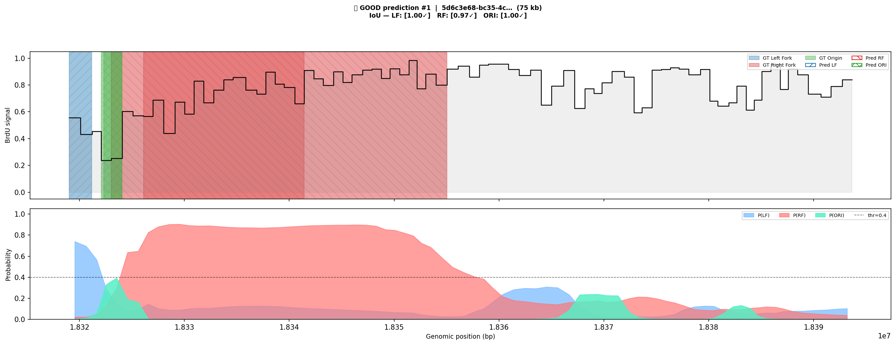
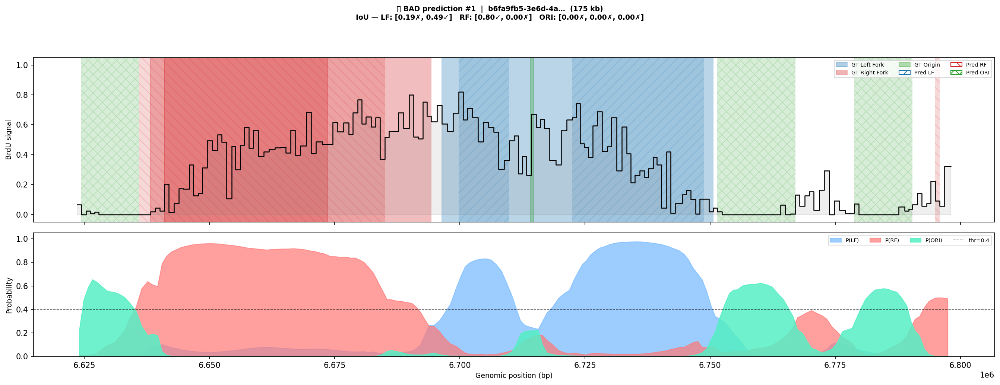
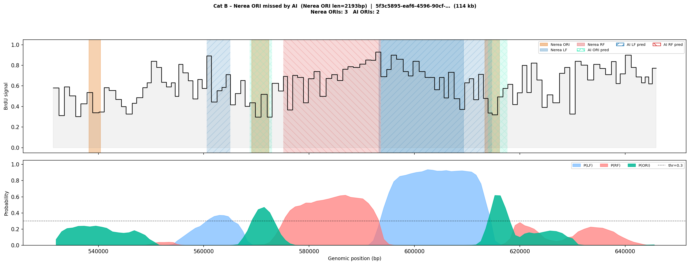
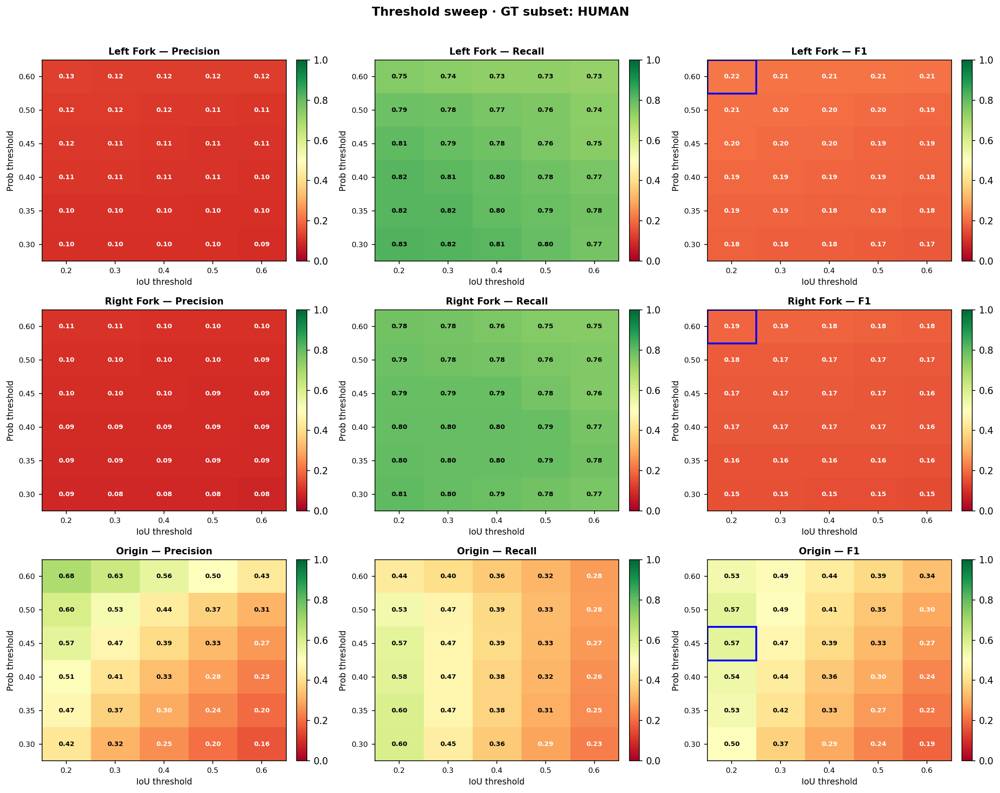
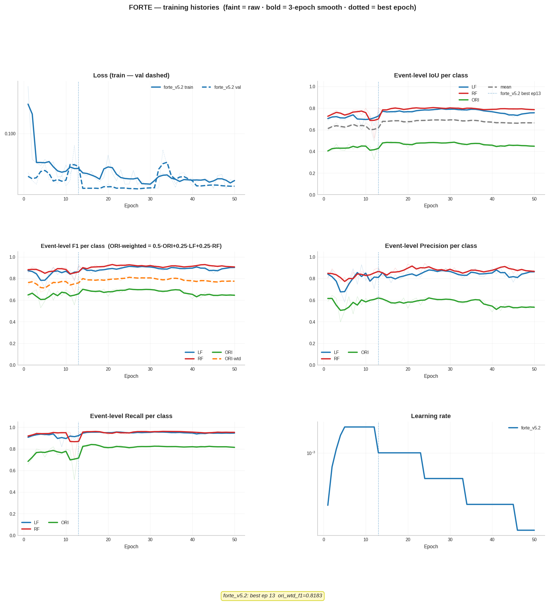

# replication-analyzer

Deep learning pipeline for annotating replication forks and origins of replication (ORIs) in single-molecule BrdU-labelled nascent DNA sequencing reads.

The core model — **FORTE** (Fork and ORigin Tracking Engine) — performs per-window 4-class segmentation of long reads: background, left fork, right fork, and origin.

---

## How it works

Each read is encoded as a multi-channel time series (9 channels: wavelet decomposition + rectangular block features) and passed through a **CNN → BiLSTM → Self-Attention** network that assigns per-window class probabilities. Consecutive high-probability windows are merged into genomic events.

### Example predictions

**Good prediction** — left fork, origin, and right fork correctly identified (IoU: LF=1.00, RF=0.97, ORI=1.00):



**Challenging read** — complex multi-feature read with label/boundary ambiguity:



**Missed origin** (Cat B) — a short Nerea-annotated ORI (~2 kb) the model does not detect above threshold. The probability track shows sub-threshold ORI signal, consistent with the small-ORI recall problem:



*Top panel: BrdU signal (step) + annotation spans (solid = GT, hatched = predicted).  
Bottom panel: per-class probability tracks; dashed line = detection threshold.*

---

## Parameter sweep

Threshold heatmaps show precision, recall, and F1 across a grid of probability thresholds × IoU matching thresholds. Blue border = best F1 cell. Evaluated on human-annotated GT reads (FORTE v5.1):



Key takeaway: fork recall is robust (LF≈0.83, RF≈0.87 at prob=0.3); ORI recall plateaus at ~60% regardless of threshold — a structural limit from short ORIs (<1 kb) that span too few model windows.

---

## Training

Training history for FORTE v5.2 (6 panels: loss, event-level IoU, F1, precision, recall, learning rate). The LR warmup ramp is visible in the first 5 epochs:



---

## Model versions

See **[FORTE_PROGRESS.md](FORTE_PROGRESS.md)** for the full version history (v4.0 → v5.3), architectural decisions, ORI recall diagnostics, and AI vs human-annotator agreement stats.

Current best model: **FORTE v5.3** (training in progress — recall-weighted monitor).

| Version | Key change | ORI recall |
|---------|-----------|-----------|
| v5.1 | Human ORI labels + HP-tuned hyperparameters | 0.82 |
| v5.2 | Small-ORI 2× oversampling + LR warmup | 0.82 |
| v5.3 | Recall-weighted monitor | in progress |

---

## Installation

```bash
git clone https://github.com/jacgonisa/replication-analyzer.git
cd replication-analyzer
pip install -e .
```

Requires Python ≥ 3.9, TensorFlow ≥ 2.13, and the packages in `requirements.txt`.

---

## Quick start — predict and annotate

```bash
# Predict forks and call ORIs on new reads
python scripts/predict_forks_and_call_oris.py \
    --config configs/forte_v5.1.yaml \
    --model  CODEX/models/forte_v5.1.keras \
    --output results/my_run/
```

Output: `reannotated_events.tsv` with columns `read_id, chr, start, end, event_type, length, max_prob, mean_prob`.

---

## Training a new model

All experiments are config-driven. Copy and modify an existing FORTE config:

```bash
cp CODEX/configs/forte_v5.1.yaml CODEX/configs/forte_my_exp.yaml
# Edit experiment_name, data paths, hyperparameters
python CODEX/scripts/train_weak5_codex.py --config CODEX/configs/forte_my_exp.yaml
```

After training, run the full evaluation pipeline:

```bash
# Training history + test evaluation + threshold heatmaps + Nerea agreement
# (See /evaluation-complete skill for step-by-step commands)
```

See **[CODEX/README.md](CODEX/README.md)** for the full FORTE training system documentation.

---

## Repository structure

```
replication-analyzer/
├── replication_analyzer/       # Core Python package
│   ├── data/                   # Signal encoding (wavelet, rectangular blocks)
│   ├── models/                 # CNN-BiLSTM-Attention architecture
│   ├── training/               # Training callbacks (focal loss, LR warmup)
│   ├── evaluation/             # Event-level IoU metrics
│   └── visualization/          # Read and training history plots
├── CODEX/
│   ├── replication_analyzer_codex/  # FORTE training library
│   ├── configs/                     # Experiment configs (forte_v*.yaml)
│   └── scripts/                     # Training, evaluation, and plotting scripts
├── scripts/                    # Prediction and ORI calling pipeline
├── configs/                    # Legacy configs
├── docs/images/forte/          # Figures used in this README
├── FORTE_PROGRESS.md           # Version history and key results
└── requirements.txt
```

---

## Documentation

| Document | Contents |
|----------|----------|
| [FORTE_PROGRESS.md](FORTE_PROGRESS.md) | Full model version history, ORI recall diagnostics, AI vs annotator agreement |
| [DATASET.md](DATASET.md) | Training data: read counts, annotation sources (human vs pseudo), signal encoding, class imbalance |
| [CODEX/README.md](CODEX/README.md) | FORTE training system: config reference, training loop, evaluation pipeline |
| [CODEX/EXPERIMENT_LOG.md](CODEX/EXPERIMENT_LOG.md) | Detailed per-experiment notes and decisions |

---

## Citation

Manuscript in preparation.
