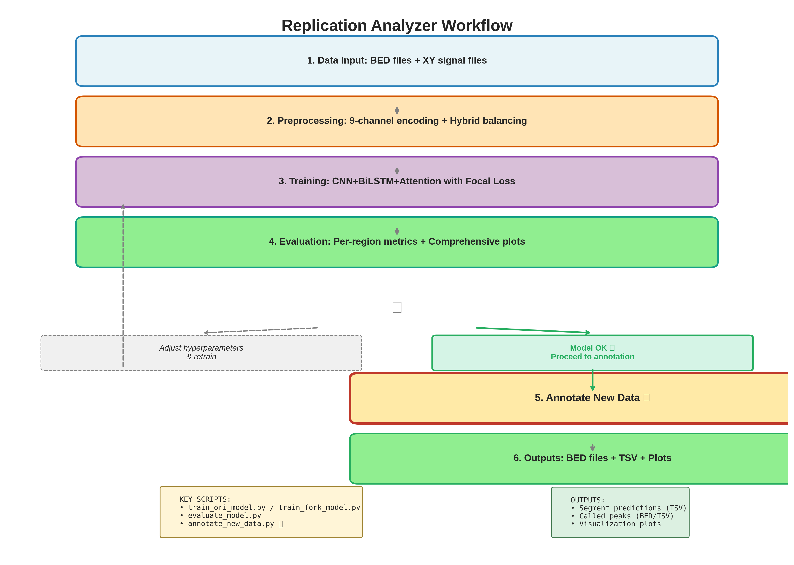
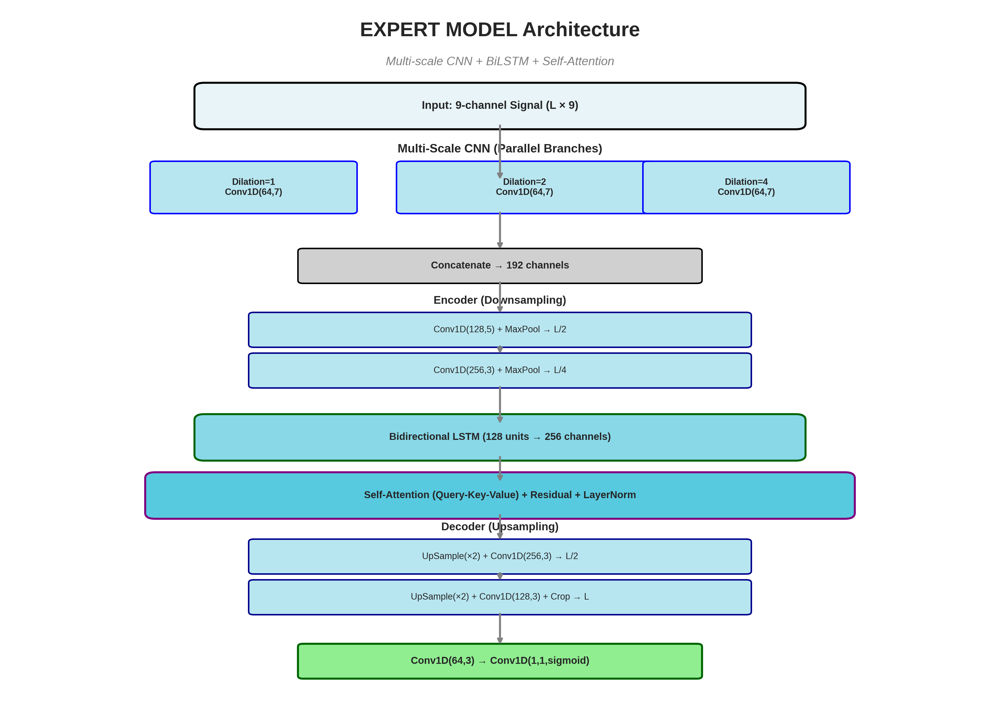
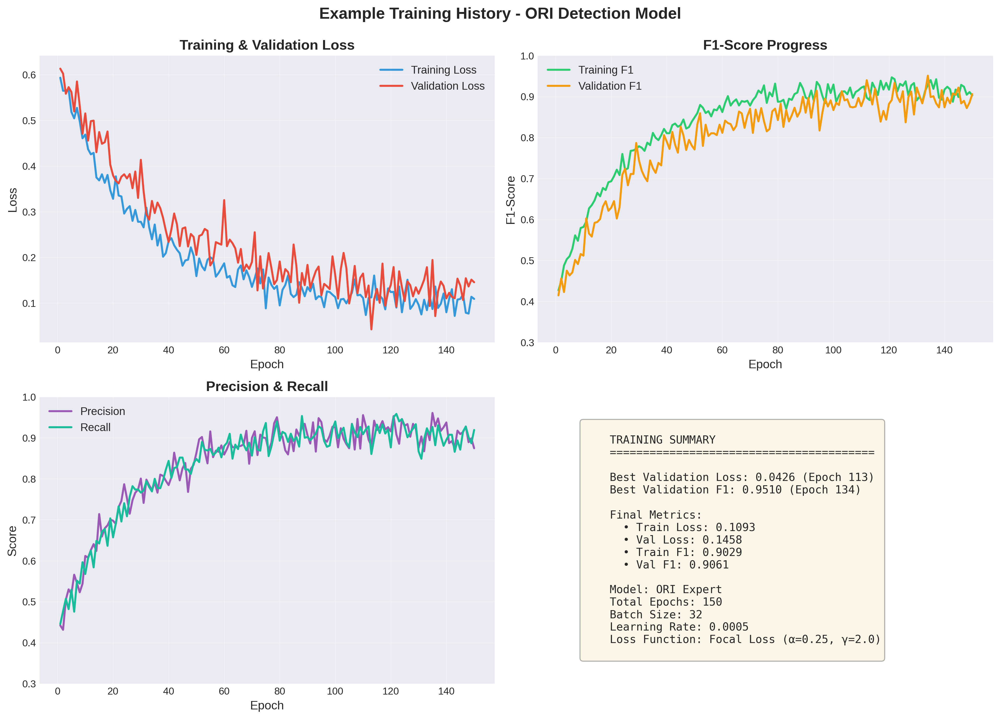
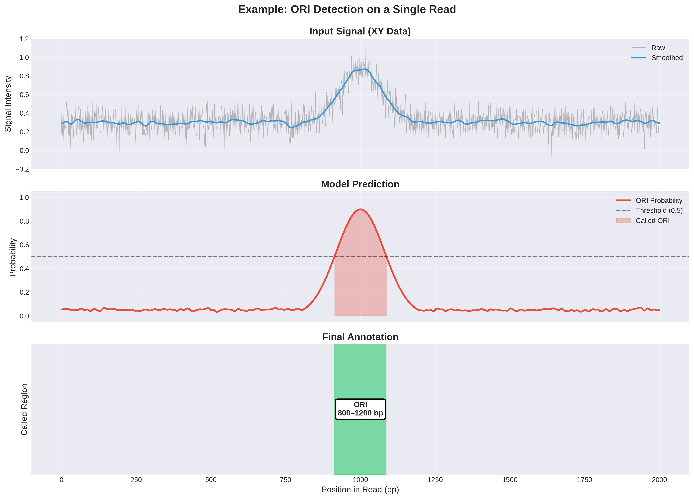

# Replication Analyzer 🧬

Deep learning models for detecting replication origins (ORIs) and replication forks in BrdU/EdU labeled DNA sequencing data.

## Overview

This package provides modular, reproducible pipelines for:
- **ORI Detection**: Binary classification of replication origin segments
- **Fork Detection**: 3-class classification (background, left fork, right fork)

### Key Features

- ✅ **Expert Models**: CNN + BiLSTM + Self-Attention architecture
- ✅ **Hybrid Balancing**: Combined oversampling + undersampling for class balance
- ✅ **Multi-channel Encoding**: 6 or 9-channel signal representations
- ✅ **Focal Loss**: Handles severe class imbalance
- ✅ **Regional Analysis**: Per-region evaluation (centromere, pericentromere, arms)
- ✅ **Config-based**: Easy to reproduce and modify experiments

## 📸 Gallery

### Workflow Overview

Complete pipeline from data input to annotation:



### Model Architecture

Expert Model: Multi-scale CNN + Bidirectional LSTM + Self-Attention



### Training Progress

Example training history showing convergence:



### Prediction Example

Model prediction on a single read showing ORI detection:



## Installation

```bash
# Clone the repository
git clone <repo-url>
cd replication-analyzer

# Create virtual environment
python -m venv venv
source venv/bin/activate  # On Windows: venv\Scripts\activate

# Install dependencies
pip install -r requirements.txt

# Install package in development mode
pip install -e .
```

## Quick Start

### 1. Prepare Your Data

Organize your data as follows:
```
data/
├── raw/
│   ├── NM30_plot_data_1strun_xy/     # XY signal data (run 1)
│   ├── NM30_plot_data_2ndrun_xy/     # XY signal data (run 2)
│   ├── curated_origins.bed           # ORI annotations
│   ├── left_forks.bed                # Left fork annotations
│   └── right_forks.bed               # Right fork annotations
└── annotations/
    ├── centromere.bed
    └── pericentromere_clean.bed
```

### 2. Train ORI Detection Model

```python
from replication_analyzer import (
    load_all_xy_data,
    load_curated_origins,
    prepare_ori_data_hybrid,
    pad_sequences,
    build_ori_expert_model,
    FocalLoss
)
from sklearn.model_selection import train_test_split

# Load data
xy_data = load_all_xy_data(
    base_dir='data/raw',
    run_dirs=['NM30_plot_data_1strun_xy', 'NM30_plot_data_2ndrun_xy']
)
ori_annotations = load_curated_origins('data/raw/curated_origins.bed')

# Prepare data (hybrid balancing)
X_seq, y_seq, info = prepare_ori_data_hybrid(
    xy_data, ori_annotations,
    oversample_ratio=0.5,
    use_enhanced_encoding=True
)

# Pad sequences
X_padded, y_padded, max_length = pad_sequences(X_seq, y_seq, percentile=100)

# Reshape labels
y_binary = (y_padded > 0.3).astype('float32').reshape(-1, max_length, 1)

# Train/val split
X_train, X_val, y_train, y_val = train_test_split(
    X_padded, y_binary, test_size=0.2, random_state=42
)

# Build model
model = build_ori_expert_model(max_length=max_length, n_channels=9)

# Compile
model.compile(
    optimizer='adam',
    loss=FocalLoss(alpha=0.25, gamma=2.0),
    metrics=['accuracy']
)

# Train
history = model.fit(
    X_train, y_train,
    validation_data=(X_val, y_val),
    epochs=100,
    batch_size=32
)

# Save model
model.save('models/ori_expert_model.keras')
```

### 3. Train Fork Detection Model

```python
from replication_analyzer import (
    load_fork_data,
    prepare_fork_data_hybrid,
    build_fork_detection_model,
    MultiClassFocalLoss
)

# Load fork data
left_forks, right_forks = load_fork_data(
    'data/raw/left_forks.bed',
    'data/raw/right_forks.bed'
)

# Prepare data
X_seq, y_seq, info = prepare_fork_data_hybrid(
    xy_data, left_forks, right_forks,
    oversample_ratio=0.5
)

# Pad and train (similar to ORI model)
X_padded, y_padded, max_length = pad_sequences(X_seq, y_seq)

# Build 3-class model
model = build_fork_detection_model(max_length=max_length, n_channels=9)

# Use multi-class focal loss
model.compile(
    optimizer='adam',
    loss=MultiClassFocalLoss(alpha=[1.0, 2.0, 2.0], gamma=2.0),
    metrics=['accuracy']
)

# Train...
```

## Using Config Files (Recommended)

Create a config file `configs/my_experiment.yaml`:

```yaml
experiment_name: "ori_detection_run1"

data:
  base_dir: "data/raw"
  run_dirs:
    - "NM30_plot_data_1strun_xy"
    - "NM30_plot_data_2ndrun_xy"
  ori_bed: "data/raw/curated_origins.bed"

preprocessing:
  oversample_ratio: 0.5
  percentile: 100
  use_enhanced_encoding: true

model:
  type: "ori_expert"
  max_length: 200
  n_channels: 9
  cnn_filters: 64
  lstm_units: 128
  dropout_rate: 0.3

training:
  epochs: 150
  batch_size: 32
  learning_rate: 0.0005
  loss:
    type: "focal"
    alpha: 0.25
    gamma: 2.0
  early_stopping_patience: 25

output:
  model_path: "models/ori_expert_model.keras"
  results_dir: "results/ori_run1"
```

Then run:
```bash
python scripts/train_ori_model.py --config configs/my_experiment.yaml
```

## Project Structure

```
replication-analyzer/
├── replication_analyzer/      # Main package
│   ├── data/                  # Data loading, encoding, preprocessing
│   ├── models/                # Model architectures and losses
│   ├── training/              # Training pipelines
│   ├── evaluation/            # Metrics and evaluation
│   └── visualization/         # Plotting utilities
├── scripts/                   # Executable scripts
├── configs/                   # Configuration files
├── notebooks/                 # Jupyter notebooks
├── data/                      # Data directory (gitignored)
├── models/                    # Saved models (gitignored)
└── results/                   # Results (gitignored)
```

## Key Components

### Signal Encoding
- **Basic (6 channels)**: Normalized, smooth, gradient, 2nd derivative, local mean/std
- **Enhanced (9 channels)**: + Z-score, cumulative trend, signal envelope

### Models
- **ORI Expert Model**: Multi-scale CNN + BiLSTM + Attention
- **Fork Detection Model**: Same architecture, 3-class output
- **Simple Models**: Baseline CNN architectures

### Balancing Strategy
- **Hybrid**: Combines oversampling minority + undersampling majority
- Target: ~1:1 read-level balance
- Handles segment-level imbalance with Focal Loss

## 📖 Documentation

- **[USAGE_GUIDE.md](USAGE_GUIDE.md)** - Complete step-by-step guide for training and annotation
- **[ARCHITECTURE.md](docs/ARCHITECTURE.md)** - Technical deep-dive: signal encoding & model architecture
- **[Example Data](data/examples/)** - Small BED files demonstrating annotation format

## For Collaborators

### Analyzing New Fork Data

When you receive new fork annotations:

1. **Place data in `data/raw/`**
2. **Update config file** with new paths
3. **Run training**:
   ```bash
   python scripts/train_fork_model.py --config configs/new_forks.yaml
   ```
4. **Evaluate**:
   ```bash
   python scripts/evaluate_model.py --model models/fork_model.keras \
       --data-config configs/new_forks.yaml --output results/new_forks/
   ```

### Batch Processing Multiple Datasets

See `scripts/batch_process.py` for processing multiple fork datasets in parallel.

## Citation

If you use this code, please cite:
```
[To be added when published]
```

## License

Private repository - not for public distribution.

## Contact

For questions or issues, contact: [Your contact info]
