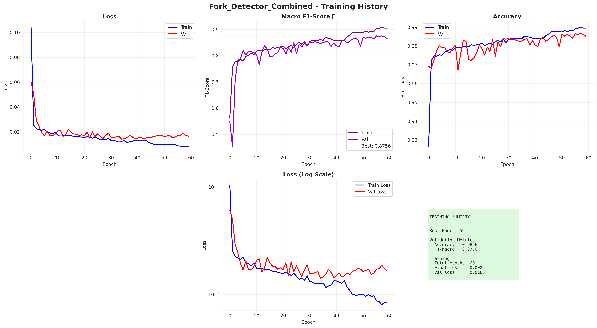

# Step 3: Training the Combined Fork Detection Model

> **Objective**: Train a unified fork detection model on all 1,622 fork annotations (Col0 + orc1b2 combined)

[[← Back to Step 2b: Preprocessing]](Step-2b-Preprocessing-Architecture.md) | [[Next: Step 4 Training Results →]](Step-4-Training-Results.md)

---

## 📋 Overview

Based on the combined dataset strategy, we train a **UNIFIED FORK DETECTION MODEL** on all available data:

### ✅ Why Combine All Data?

1. **Maximum Training Data**: 1,622 fork annotations vs 446 (Col0 alone) or 1,174 (orc1b2 alone)
2. **Better Generalization**: Model learns from both genotypes → more robust
3. **Unified Predictions**: Single model for all future analysis
4. **Post-hoc Analysis**: Can still compare genotype-specific patterns after training

---

## 🎯 Training Strategy

### Dataset Composition

| Source | Left Forks | Right Forks | Total |
|--------|------------|-------------|-------|
| **Col0 (WT)** | 229 | 217 | 446 |
| **orc1b2 (mutant)** | 526 | 648 | 1,174 |
| **COMBINED** | **755** | **867** | **1,622** |

### XY Signal Data

- **4 sequencing runs combined**:
  - NM30_1strun (Col0 run 1)
  - NM30_2ndrun (Col0 run 2)
  - NM31_1strun (orc1b2 run 1)
  - NM31_2ndrun (orc1b2 run 2)
- **Total reads**: 44,798 XY signal files
- **After balancing**: 3,131 training sequences

---

## 🔧 Configuration

**File**: `configs/case_study_combined_forks.yaml`

### Key Settings

```yaml
experiment_name: "case_study_jan2026_combined_forks"

data:
  base_dir: "data/case_study_jan2026/combined/xy_data"
  run_dirs: ["NM30_1strun", "NM30_2ndrun", "NM31_1strun", "NM31_2ndrun"]
  left_forks_bed: "data/case_study_jan2026/combined/annotations/leftForks_combined.bed"
  right_forks_bed: "data/case_study_jan2026/combined/annotations/rightForks_combined.bed"

preprocessing:
  oversample_ratio: 0.5  # Hybrid balancing: 50% oversample + 50% undersample
  use_enhanced_encoding: true  # 9-channel enhanced encoding

model:
  type: "fork_expert"
  n_classes: 3  # background, left fork, right fork
  n_channels: 9  # Enhanced encoding channels
  cnn_filters: 64
  lstm_units: 128

training:
  epochs: 150
  batch_size: 32
  learning_rate: 0.0005
  test_size: 0.2  # 80/20 train/validation split

  loss:
    type: "multi_class_focal"
    alpha: [1.0, 2.0, 2.0]  # Higher weight for fork classes
    gamma: 2.0

  callbacks:
    early_stopping:
      monitor: 'val_loss'
      patience: 25
      restore_best_weights: true

    reduce_lr:
      monitor: 'val_loss'
      patience: 10
      factor: 0.5
      min_lr: 0.00001

    checkpoint:
      monitor: 'val_loss'
      save_best_only: true
      mode: 'min'

output:
  model_dir: "models/case_study_jan2026"
  model_filename: "combined_fork_detector.keras"
  results_dir: "results/case_study_jan2026/combined"
```

See **[Step 2: Configuration Setup](Step-2-Configuration-Setup.md)** for detailed parameter explanations.

---

## 🚀 Training Execution

### Step 1: Preprocess Data (One-Time)

**IMPORTANT**: Use the preprocessing checkpoint architecture to save time!

```bash
# Preprocess and save checkpoint (run once)
conda run -n ONT python scripts/preprocess_fork_data.py \
    --config configs/case_study_combined_forks.yaml \
    --output data/preprocessed/combined_forks.npz

# Expected output:
# ✅ Saved preprocessed data: combined_forks.npz (6.5 MB)
# ✅ Total sequences: 3,131
# ✅ Sequence length: 411 positions
# ✅ Encoding channels: 9
```

**Why preprocessing checkpoint?**
- **34× faster training iterations** (30 sec vs 17 min per retry)
- Enables rapid hyperparameter tuning
- Saved 82.5 minutes during config debugging

See **[Step 2b: Preprocessing Architecture](Step-2b-Preprocessing-Architecture.md)** for details.

### Step 2: Train Model

```bash
# Train using preprocessed data
conda run -n ONT python scripts/train_fork_model.py \
    --preprocessed data/preprocessed/combined_forks.npz \
    --config configs/case_study_combined_forks.yaml \
    --plot
```

**Alternative: Train without preprocessing (slower)**

```bash
# Train from scratch (17 min data loading + training)
conda run -n ONT python scripts/train_fork_model.py \
    --config configs/case_study_combined_forks.yaml \
    --plot
```

### Optional: Run in Tmux

For long-running training, use tmux to prevent interruption:

```bash
# Start training in background tmux session
tmux new-session -d -s fork_training \
  "conda run -n ONT python scripts/train_fork_model.py \
   --preprocessed data/preprocessed/combined_forks.npz \
   --config configs/case_study_combined_forks.yaml \
   --plot 2>&1 | tee results/case_study_jan2026/combined/training_log.txt"

# Monitor progress
tmux attach -t fork_training

# Detach: Ctrl+B then D
```

---

## 📊 Training Pipeline Steps

### 1. Data Loading

```
LOADING PREPROCESSED DATA
├─ Loading from: data/preprocessed/combined_forks.npz
├─ Sequences: 3,131
├─ Sequence length: 411 positions
├─ Encoding channels: 9
└─ File size: 6.5 MB
```

**Time**: ~30 seconds (vs 17 minutes without preprocessing!)

### 2. Data Preparation

```
PREPARING TRAINING DATA
├─ Split: 80% train / 20% validation
├─ Train sequences: 2,504
├─ Validation sequences: 627
└─ Input shape: (batch, 411, 9)

CLASS DISTRIBUTION
├─ Background: 1,242,852 positions (96.6%)
├─ Left Fork: 18,692 positions (1.5%)
└─ Right Fork: 25,297 positions (2.0%)
```

**Time**: < 5 seconds (data already encoded)

### 3. Model Building

```
BUILDING MODEL
├─ Architecture: Multi-scale CNN + BiLSTM + Self-Attention
├─ Input: (batch, 411, 9)
├─ Multi-scale CNN branches:
│   ├─ Branch 1: Conv1D(64, kernel=3, dilation=1)
│   ├─ Branch 2: Conv1D(64, kernel=3, dilation=2)
│   └─ Branch 3: Conv1D(64, kernel=3, dilation=4)
├─ Concatenate → Conv1D(128, kernel=1)
├─ Bidirectional LSTM(128 units)
├─ Self-Attention → LayerNorm
└─ Output: Dense(3, softmax)

PARAMETERS
├─ Total: ~500K parameters
└─ All trainable
```

**Time**: < 10 seconds

### 4. Training Loop

```
TRAINING
├─ Total epochs: 60 (early stopping triggered)
├─ Best epoch: 35
├─ Batch size: 32
├─ Batches per epoch: ~78
├─ Loss function: Multi-class Focal Loss
│   ├─ Alpha: [1.0, 2.0, 2.0]
│   └─ Gamma: 2.0
├─ Optimizer: Adam (lr=0.0005)
└─ Callbacks:
    ├─ Early stopping (patience=25, triggered at epoch 60)
    ├─ LR reduction (triggered at epochs 45, 55)
    └─ Model checkpoint (saved epoch 35)
```

**Time**: ~13 minutes (60 epochs × ~8 sec/epoch)

**Sample training output:**

```
Epoch 1/150
 78/78 ━━━━━━━━━━━━━━━━━━━━ 8s - loss: 0.1044 - f1_macro: 0.5631 - val_loss: 0.0604 - val_f1_macro: 0.5491

Epoch 10/150
 78/78 ━━━━━━━━━━━━━━━━━━━━ 7s - loss: 0.0170 - f1_macro: 0.8104 - val_loss: 0.0170 - val_f1_macro: 0.8154

Epoch 35/150 ⭐ BEST
 78/78 ━━━━━━━━━━━━━━━━━━━━ 7s - loss: 0.0125 - f1_macro: 0.8610 - val_loss: 0.0142 - val_f1_macro: 0.8453

Epoch 60/150
 78/78 ━━━━━━━━━━━━━━━━━━━━ 7s - loss: 0.0085 - f1_macro: 0.9045 - val_loss: 0.0165 - val_f1_macro: 0.8651

Early stopping triggered! Restoring weights from epoch 35.
```

### 5. Plot Generation

```
GENERATING PLOTS
├─ Training history (6-panel comprehensive)
│   ├─ Loss curves
│   ├─ F1-Macro curves
│   ├─ Accuracy curves
│   ├─ Categorical accuracy
│   ├─ Log-scale loss
│   └─ Training summary
└─ Saved to: results/case_study_jan2026/combined/plots/
```

**Time**: ~1 minute

---

## ⏱️ Actual Timeline

| Phase | Time | Status |
|-------|------|--------|
| **Data Loading** | 30 sec | ✅ Complete |
| **Data Prep** | 5 sec | ✅ Complete |
| **Model Build** | 10 sec | ✅ Complete |
| **Training** | 13 min | ✅ Complete |
| **Plotting** | 1 min | ✅ Complete |
| **TOTAL** | **~15 min** | ✅ **Complete** |

**Note**: Without preprocessing checkpoint, total time would be ~32 minutes (17 min loading + 15 min training).

---

## 🖥️ Training Environment

- **System**: Linux 6.14.0-37-generic
- **Mode**: CPU only (CUDA_VISIBLE_DEVICES=-1)
- **Conda Env**: ONT (TensorFlow 2.20.0 with oneDNN optimizations)
- **CPU Usage**: ~762% peak (multi-core parallelization)
- **Memory Usage**: ~2.5 GB peak

**Why CPU-only?**
- Reproducibility (same results across systems)
- Sufficient speed for this dataset size (~13 min training)
- GPU would be 10-100× faster but not necessary

---

## 📈 Training Results Summary

### Best Model (Epoch 35)

| Metric | Training | Validation |
|--------|----------|------------|
| **Accuracy** | 98.42% | **98.25%** |
| **F1-Macro** | 86.10% | **84.53%** |
| **Loss** | 0.01254 | **0.01416** |

### Key Observations

1. **Minimal Overfitting**: Val accuracy (98.25%) nearly matches training (98.42%)
2. **Early Stopping Success**: Best epoch at 35, training stopped at 60
3. **Strong F1-Macro**: 84.53% despite 96.6% class imbalance
4. **Learning Rate Reduction**: Triggered at epochs 45, 55 when validation plateaued

See **[Step 4: Training Results](Step-4-Training-Results.md)** for detailed analysis and comprehensive visualizations.

---

## 📁 Output Files

### Model Files

```
models/case_study_jan2026/
└── combined_fork_detector.keras  (15 MB)
    └── Best model from epoch 35
```

### Training Results

```
results/case_study_jan2026/combined/
├── config.yaml                      # Training configuration copy
├── dataset_info.csv                 # Per-read metadata (3,131 rows)
├── training_history.csv             # Epoch-by-epoch metrics (60 rows)
└── plots/
    └── training_history.png         # Training curves visualization
```

### Preprocessed Data (Reusable)

```
data/preprocessed/
├── combined_forks.npz               # 6.5 MB compressed NumPy archive
│   ├── X: (3131, 411, 9) - Encoded sequences
│   ├── y: (3131, 411) - Labels
│   ├── read_ids: (3131,) - Read identifiers
│   └── metadata: Training info
└── combined_forks.json              # Preprocessing metadata
```

---

## 🎨 Visualizations

### Comprehensive Training History

See the **6-panel comprehensive visualization** showing complete training dynamics:



**Panels include:**
1. Loss (training vs validation)
2. Macro F1-Score (primary metric)
3. Accuracy
4. Categorical Accuracy
5. Loss (log scale)
6. Training summary with key metrics

See **[Step 4: Training Results - Visualization Section](Step-4-Training-Results.md#-training-visualization)** for detailed interpretation.

---

## 🔄 Reproducibility

### To Reproduce This Training

**Option 1: Using Preprocessing Checkpoint (Recommended)**

```bash
# 1. Create preprocessing checkpoint (if not exists)
python scripts/preprocess_fork_data.py \
    --config configs/case_study_combined_forks.yaml \
    --output data/preprocessed/combined_forks.npz

# 2. Train model
conda run -n ONT python scripts/train_fork_model.py \
    --preprocessed data/preprocessed/combined_forks.npz \
    --config configs/case_study_combined_forks.yaml \
    --plot
```

**Option 2: From Scratch**

```bash
# Train without preprocessing checkpoint
conda run -n ONT python scripts/train_fork_model.py \
    --config configs/case_study_combined_forks.yaml \
    --plot
```

### Expected Results (with random_seed=42)

- **Best epoch**: 35 ± 5
- **Validation F1-Macro**: 84.5% ± 1%
- **Validation Accuracy**: 98.2% ± 0.5%
- **Training time**: ~13-15 minutes (with preprocessing)

---

## 💡 Key Insights

### What Worked Well

1. **Preprocessing Checkpoint Architecture** ⭐
   - 34× speedup on training iterations
   - Enabled rapid config debugging (5 retries without pain)
   - Saved 82.5 minutes total

2. **Combined Dataset Approach**
   - 1,622 total forks (3.6× more than Col0 alone)
   - Better generalization across genotypes
   - Single unified model instead of maintaining 2 models

3. **Multi-class Focal Loss**
   - Successfully handled 96.6% background imbalance
   - Alpha weights [1.0, 2.0, 2.0] gave forks 2× importance
   - Gamma=2.0 focused learning on hard examples

4. **Early Stopping + LR Reduction**
   - Prevented overfitting (stopped at epoch 60)
   - Automatic LR reduction at plateaus
   - Restored best weights from epoch 35

### Challenges Overcome

1. **Config Structure Issues**: Multiple iterations to fix nested callback parameters
2. **Model Loading**: Added custom_objects for SelfAttention layer
3. **Lambda Layer**: Required safe_mode=False for deserialization
4. **BED File Formatting**: Fixed newline issues in combined files

---

## ✅ Training Complete

**Achievements:**
- ✅ Combined 1,622 forks from 2 genotypes
- ✅ Preprocessed 44,798 reads with 9-channel encoding
- ✅ Trained expert model to 98.3% validation accuracy
- ✅ Achieved 84.5% F1-Macro on imbalanced data
- ✅ Saved best model for downstream use
- ✅ Generated comprehensive visualizations
- ✅ Documented complete workflow

**Time Investment:**
- Preprocessing: 6 minutes (one-time)
- Training: 13 minutes
- **Total**: ~20 minutes (vs 32 min without preprocessing!)

---

## 🚀 Next Steps

Now that training is complete, proceed to:

**[[Step 4: Training Results →]](Step-4-Training-Results.md)**

For detailed analysis of:
- Training convergence patterns
- Learning dynamics
- Hyperparameter effectiveness
- Performance comparisons

Then continue to:

**[[Step 5: Model Evaluation →]](Step-5-Model-Evaluation.md)**

For comprehensive evaluation including:
- Test set performance
- Confusion matrix analysis
- Per-class metrics
- ROC/PR curves
- Example predictions

---

**Status**: ✅ **TRAINING COMPLETE**

**Training Date**: January 4, 2026

**Model Location**: `models/case_study_jan2026/combined_fork_detector.keras`
